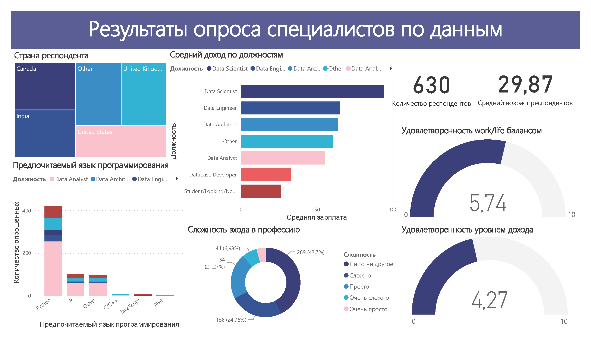

# Дашборд по результатам опроса специалистов по данным (учебный проект)

В рамках этого проекта разработан интерактивный дашборд в Power BI, предоставляющий анализ информации о специалистах по данным.

Исходные данные: результаты опроса 630 респондентов. Датасет представлен в формате Excel.

Данные были подготовлены и на их основе создан дашборд:

